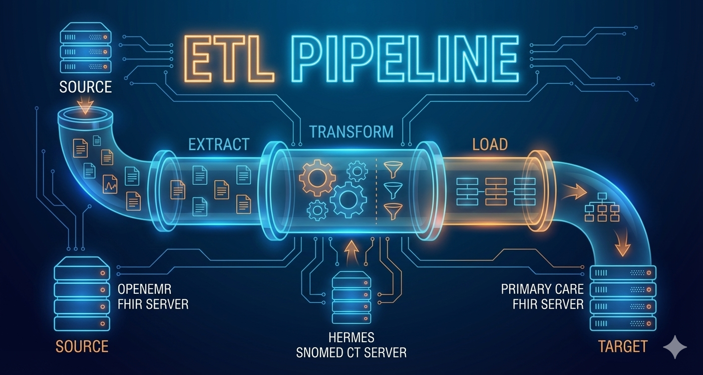

<!DOCTYPE html>
<html lang="en">
<head>
  <meta charset="UTF-8">
  <meta name="viewport" content="width=device-width, initial-scale=1.0">
  <title>About / Presentation</title>
  
</head>
<body>

  

    
    <h1 class="glow-text">About / Presentation</h1>

    <nav class="dark-nav">
      <strong>Navigation:</strong> 
      <a href="index.html">Home</a> | 
      <a href="etl_pipeline.html">ETL Pipeline</a> | 
      <a href="insights.html">Insights</a> | 
      <a href="team_contrib.html">Team Contributions</a> | 
      <a href="about.html" class="active">About / Presentation</a>
    </nav>

    

      
    

      
  

<h2>Problem Statement & Objective</h2>

Healthcare systems often struggle to exchange data due to incompatible formats, standards, and protocols.

Our goal was to extract patient data from OpenEMR (FHIR), transform it, and load it into a Primary Care FHIR server, then generate an HL7 v2 message for interoperability with legacy systems.

<h3>Why FHIR?</h3>
<ul>
  <li>It is a modern standard used for health data exchange</li>
  <li>Stores data in JSON/XML, which is easy for software to process</li>
  <li>Works through REST APIs, so programs can access data automatically</li>
  <li>Makes it easier for systems to share medical information</li>
</ul>

<h3>Why HL7 v2?</h3>
<ul>
  <li>Many hospitals still use older systems that expect HL7 messages</li>
  <li>HL7 allows those systems to understand patient information</li>
  <li>By creating HL7 output, we show that our data can be used by both new and old systems</li>
  <li>It proves real interoperability in healthcare</li>
</ul>

<h2>ETL Pipeline Overview</h2>

We built a reusable ETL workflow that:

<ol>
  <li><strong>Extracts</strong> a real Patient and Condition from OpenEMR</li>
  <li><strong>Transforms</strong> SNOMED codes using Hermes to identify parent and child terms</li>
  <li><strong>Creates</strong> structured resources (Patient, Condition, Observation, Procedure) on the target FHIR server</li>
  <li><strong>Performs validation</strong> to confirm profile compliance using <code>$validate</code></li>
  <li><strong>Generates</strong> an HL7 ADT message using selected Condition and ICD-10 mapping</li>
</ol>

Below is a conceptual visualization:

OpenEMR (FHIR Source)
    │
    │ Extract (FHIR API + Token Auth)
    ▼
Python ETL Script
    │
    │ Transform (Hermes SNOMED CT + Mapping)
    ▼
Primary Care FHIR Target
    │
    │ Load + Validate
    ▼
HL7 v2

<h2>ETL Pipeline Demonstration</h2>

We will now walk through each task separately, demonstrating the required five coding tasks.

  <h3>Task 1 – Parent ETL: Patient + Gingivitis Condition</h3>
  
  
<strong>Extract:</strong>

  <ul>
    <li>We searched patients using FHIR search parameters: family=Kuvalis&gender=male</li>
    <li>Retrieved conditions → identified SNOMED 66383009 Gingivitis</li>
  </ul>
  
  
<strong>Transform:</strong>

  <ul>
    <li>Looked up parent SNOMED concept using Hermes → 18718003 Gingival disease</li>
  </ul>
  
  
<strong>Load:</strong>

  <ul>
    <li>Created a new cloned Patient with transformed address + identifier</li>
    <li>Posted Condition to Target FHIR server</li>
    <li>Saved patient.json & condition.json locally</li>
  </ul>
  
  

    <strong>Output:</strong> Patient + Condition successfully cloned & stored
  

  <h3>Task 2 – Child ETL: Create Child Condition</h3>
  
  
<strong>Extract:</strong>

  <ul>
    <li>Used gingivitis again for the same patient (validation of task flow)</li>
  </ul>
  
  
<strong>Transform:</strong>

  <ul>
    <li>Used child concept → 31642005 Acute Gingivitis</li>
  </ul>
  
  
<strong>Load:</strong>

  <ul>
    <li>Posted Condition to Target server</li>
    <li>Saved → task2_child.json</li>
    <li>Validated using $validate with meta.profile</li>
  </ul>
  
  

    <strong>Result:</strong> Both parent & child conditions now exist for cloned patient
  

  <h3>Task 3 – Observation ETL (Blood Pressure)</h3>
  
  
<strong>Extract:</strong>

  <ul>
    <li>Check if Observation 85354-9 exists; if server returns 0 or fails, fall back to template</li>
    <li>Check OpenEMR for BP Observation → none found</li>
  </ul>
  
  
<strong>Transform:</strong>

  <ul>
    <li>Load local observation_task3.json template</li>
    <li>Insert Patient ID</li>
    <li>Updated timestamp automatically</li>
  </ul>
  
  
<strong>Load:</strong>

  <ul>
    <li>Posted to target → Observation created successfully</li>
    <li>Save observation/results locally</li>
    <li>Verification GET performed</li>
  </ul>
  
  

    <strong>Output:</strong> Generated new BP Observation successfully (ID example: 124)
  

  <h3>Task 4 – Procedure ETL</h3>
  
  
<strong>Extract:</strong>

  <ul>
    <li>Check Procedures for patient</li>
    <li>Search OpenEMR → No procedure found</li>
  </ul>
  
  
<strong>Transform:</strong>

  <ul>
    <li>If none → use template (procedure_task4.json)</li>
    <li>Insert patient link + performedDateTime</li>
  </ul>
  
  
<strong>Load:</strong>

  <ul>
    <li>Posted to target → Saved new Procedure ID</li>
    <li>Verified using GET request</li>
  </ul>
  
  

    <strong>Output:</strong> Procedure successfully created and confirmed via read-back check
  

  <h3>Task 5 – HL7 Interoperability Conversion</h3>
  
  
<strong>Data used:</strong> FHIR JSON → HL7 v2.5 ADT A01 format

  
  
<strong>Steps:</strong>

  <ul>
    <li>Retrieve Patient + Conditions + Encounters again</li>
    <li>Fetch Patient, Condition, Encounter</li>
    <li>Prioritize COVID-19 SNOMED 840539006</li>
    <li>Map SNOMED 840539006 (COVID-19) → ICD10 using Hermes</li>
    <li>Automatically map SNOMED → ICD-10 using Hermes mapping set</li>
    <li>Generate segments:
      <ul>
        <li>MSH (header)</li>
        <li>PID (patient demographics)</li>
        <li>PV1 (visit/encounter info)</li>
        <li>DG1 (diagnosis with SNOMED → ICD10 mapping)</li>
      </ul>
    </li>
    <li>Generate HL7 ADT_A01 message with MSH, EVN, PID, PV1, DG1</li>
    <li>Saved to task5_adt_message.txt</li>
    <li>Export .txt file</li>
  </ul>
  
  

    <strong>Output:</strong> HL7 message produced successfully and ready for integration workflows
  

<h2>Why This Project Matters</h2>
<ul>
  <li><strong>FHIR</strong> enables consistent clinical data exchange</li>
  <li><strong>SNOMED CT</strong> enriches meaning and hierarchical context</li>
  <li><strong>ICD-10 mappings</strong> support downstream billing workflows</li>
  <li><strong>HL7 v2</strong> remains widely used in hospitals, especially for admissions, transitions of care, and claims</li>
  <li><strong>Modern interoperability</strong> requires all these pieces working together</li>
</ul>

Our implementation shows how health information moves from EHR to terminology service, and finally to another EHR and HL7 v2 system, maintaining:

<ul>
  <li>Data structure</li>
  <li>Clinical meaning</li>
  <li>Coding integrity</li>
  <li>Interoperability</li>
</ul>

<h2>Real-World Application</h2>

<strong>If we were working in a real healthcare organization:</strong>

<ul>
  <li>This ETL pipeline enables clean migration of patient data</li>
  <li>Supports system-to-system interoperability</li>
  <li>Allows FHIR clinical data to be consumed by legacy HL7 systems</li>
  <li>Automates patient cloning, condition mapping, observation + procedure recording</li>
</ul>

This ensures that hospitals, clinics, and EHRs exchange information accurately and securely.

<h2>About the Team</h2>

We are currently pursuing a <strong>Master of Science in Health Informatics</strong> at Indiana University Indianapolis, combining our clinical backgrounds with data systems, interoperability standards, and applied informatics.

  

    
    <h3>FNU Lakshitha</h3>
    Delhi, India
    
Bachelor's in Pharmacy — now studying Health Informatics and developing skills in standardized terminologies, API data integration, and digital workflows.

  

  

    
    <h3>Sakshi Mehta</h3>
    Gujarat, India
    
Bachelor's in Dental Surgery — now studying Health Informatics and applying knowledge of clinical documentation and interoperability.

  

  

    
    <h3>Bhavitha Asam</h3>
    Telangana , India
    
Bachelor's in Dental Surgery — now studying Health Informatics with interest in EHR usability, digital care documentation, and practice workflows.

  

  

    
    <h3>Aravind Kuruvikkattil Venugopalan</h3>
    Kerala, India
    
Bachelor's in Ayurvedic Medicine — now studying Health Informatics and focusing on structured terminology, data mapping, and ETL automation.

  

  <a href="index.html">← Back to Home</a>
  <a href="etl_pipeline.html">View ETL Pipeline →</a>

</body>
</html>
