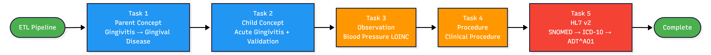

  

    
    <h1 class="glow-text">INFO-B581 Final Project: ETL Pipeline</h1>

    <nav class="dark-nav">
      <strong>Navigation:</strong> 
      <a href="index.html" class="active">Home</a> | 
      <a href="etl_pipeline.html">ETL Pipeline</a> | 
      <a href="insights.html">Insights</a> | 
      <a href="team_contrib.html">Team Contributions</a> | 
      <a href="about.html">About / Presentation</a>
    </nav>

    

      
    

      
  

---

## Project Overview

Our INFO-B581 final project implements an **ETL (Extract–Transform–Load) pipeline** that moves clinical data from an **OpenEMR FHIR server** (source) to a **Primary Care FHIR server** (target), using the **Hermes SNOMED CT terminology server** to standardize condition concepts.

  

    <h3> Goal</h3>
    

      Build a reproducible ETL pipeline that extracts FHIR resources, transforms them with SNOMED CT 
      parent/child relationships, and loads clean, validated data into a Primary Care FHIR server.
    

  

  

    <h3> Data Sources</h3>
    <ul>
      <li>Patients, Conditions, Observations and Procedures from the OpenEMR FHIR server</li>
      <li>SNOMED CT concepts and relationships from the Hermes terminology server</li>
      <li>Target resources stored in a Primary Care FHIR server</li>
    </ul>
  

  <h3>Technologies</h3>
  <ul>
    <li><strong>Python 3</strong> (Scripting & ETL)</li>
    <li><strong>PyCharm</strong> (Development IDE)</li>
    <li><strong>Postman</strong> (API Testing & Validation)</li>
    <li><strong>FHIR R4 REST APIs</strong> (JSON)</li>
    <li><strong>Hermes</strong> (SNOMED CT Terminology Server)</li>
    <li><strong>Git & GitHub</strong> (Version Control)</li>
    <li><strong>GitHub Pages + Jekyll</strong> (Documentation Website)</li>
  </ul>
  

---

## ETL Pipeline at a Glance

The pipeline follows a systematic approach:

1. **Extract** – Retrieve patient, condition, observation and procedure data from the OpenEMR FHIR server
2. **Transform** – Transform condition codes using SNOMED CT parent and child concepts from Hermes
3. **Load** – Store standardized FHIR resources into the Primary Care FHIR server
4. **Validate** – Verify resources against FHIR profile (Patient and Condition)

  

---

## Summary of Deliverables

- Python ETL scripts for **Tasks 1–5** in the `src/` folder  
- Validated **Patient** and **Condition** resources using custom profiles  
- Reproducible approach for creating Observations  
- Comprehensive project documentation including:
   - System architecture and ETL pipeline details
   - Detailed coding tasks and implementation
   - Individual team contributions and reflections

---

## Quick Links

- [View ETL Pipeline Documentation](etl_pipeline.html)
- [Read Project Insights](insights.html)
- [Meet the Team](team_contrib.html)
- [About & Presentation](about.html)

---

