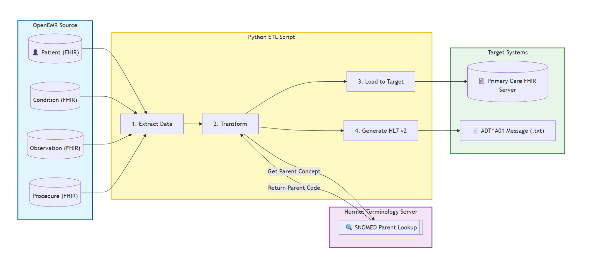

  

    
    <h1 class="glow-text">Project Insights & Key Learnings</h1>

    <nav class="dark-nav">
      <strong>Navigation:</strong> 
      <a href="index.html">Home</a> | 
      <a href="etl_pipeline.html">ETL Pipeline</a> | 
      <a href="insights.html" class="active">Insights</a> | 
      <a href="team_contrib.html">Team Contributions</a> | 
      <a href="about.html">About / Presentation</a>
    </nav>

    

      
    

      
  

---

## What We Learned

Our project journey with OpenEMR and FHIR was as much about collaboration and problem-solving as it was about technology. Along the way, we deepened our understanding of healthcare data standards, refined our engineering practices, and learned how to work effectively as a team on a complex integration pipeline.

---

## Technical Insights

Throughout the project, we explored real-world interoperability challenges and built practical solutions around them.

- **OAuth token reuse**: We learned how to authenticate once and safely reuse OAuth access tokens across multiple FHIR endpoints, simplifying our workflow and reducing redundant handshakes.

- **Efficient FHIR searches**: By using query parameters such as `family`, `gender`, `birthdate`, and `patient`, we were able to retrieve precise clinical data without over-fetching.

- **SNOMED CT relationships**: Working with the SNOMED CT hierarchy through the Hermes `/extended` endpoint helped us understand how parent and child concepts are linked within the terminology service.

- **Idempotent ETL design**: We designed our ETL scripts to be safe for re-runs—ensuring repeatable and predictable results whenever we needed to test or debug our code.

- **Resource validation**: Using the `$validate` operation on our FHIR server allowed us to confirm that our custom profiles adhered to expected standards, improving the overall quality and consistency of our data.

---

## Project & Team Insights

Beyond the technical work, the success of our project depended on how we organized and collaborated as a team.

- **Task-based division**: Dividing the workflow into Tasks 1-5 made it easier to assign ownership, maintain accountability, and work efficiently in parallel.

- **Consistent repository structure**: Using a uniform folder layout (`src/`, `data/`, `assets/`) kept our codebase clean and intuitive for everyone.

- **Document-first mindset**: Writing comprehensive documentation for each step forced us to articulate our process clearly, which helped us identify knowledge gaps early.

- **Incremental commits**: Making small, frequent commits proved far more effective than large, end-of-day pushes when debugging complex ETL logic.

- **Lightweight communication**: We used GitHub Issues and Discussions as an informal but effective way to track progress, troubleshoot problems, and stay aligned across tasks.

---

## Challenges and How We Resolved Them

Every significant technical journey comes with hurdles. Here are some of the key challenges we faced and how we overcame them:

- **OAuth access token authentication**: Initially, we encountered difficulties obtaining and maintaining valid access tokens for API authentication. We resolved this by seeking guidance from our professor and organizing troubleshooting sessions where all four team members worked together, testing the authentication flow on individual machines to identify environment-specific issues and share solutions.

- **SNOMED CT hierarchy mapping**: Mapping child terms to their correct parent concepts required careful analysis of the Hermes API responses. We experimented with the `/extended` endpoint and studied fields like `parentRelationships`, `preferredDescription`, and `fsn` until we could consistently retrieve accurate hierarchical mappings.

- **ICD-10 mapping limitations**: We discovered that Gingivitis (SNOMED CT code 66383009) did not have a direct or reliable mapping to ICD-10 codes in our terminology server. To demonstrate the complete ETL workflow including ICD-10 conversion for HL7 v2 messaging, we switched our clinical scenario to use COVID-19 as the primary condition, which has well-established ICD-10 mappings and allowed us to showcase the full interoperability pipeline.

- **GitHub Pages deployment issues**: Publishing our documentation website to GitHub Pages presented several technical challenges. We resolved these by standardizing our folder structure, using relative links consistently, and thoroughly testing the site locally before deployment.

---

## ETL Pipeline Architecture

The diagram below illustrates our complete end-to-end ETL workflow, showing how data flows from the OpenEMR source system through our Python transformation pipeline, with terminology enrichment from Hermes, and ultimately into both modern FHIR-based and legacy HL7 v2 target systems.

  

**Key workflow components:**

1. **Extract**: Patient, Condition, Observation, and Procedure resources are retrieved from the OpenEMR FHIR server using authenticated API calls
2. **Transform**: Clinical data is enriched using SNOMED CT parent/child concept lookups from the Hermes terminology server, and restructured to match target system requirements
3. **Load to Target**: Transformed resources are validated and posted to the Primary Care FHIR server with proper patient references and profile conformance
4. **Generate HL7 v2**: FHIR resources are converted into ADT^A01 messages for legacy system interoperability, including ICD-10 code mapping

This architecture demonstrates how modern healthcare systems can bridge the gap between contemporary FHIR-based platforms and traditional HL7 v2 messaging infrastructure.

---

## Potential Improvements

Looking ahead, there's plenty of room for refinement and expansion. Some of our priority ideas include:

- Extending the ETL pipeline to more FHIR resources such as Encounters, Allergies, and Medications, following the same architectural pattern.

- Implementing more robust error handling and structured logging to capture timeouts, retries, and other runtime events.

- Moving all configuration—URLs, IDs, codes, profile links—into a single, external YAML or JSON file for easier updates and standardization.

- Packaging the entire ETL logic into a Python module for smoother reuse across projects or teams.

---

